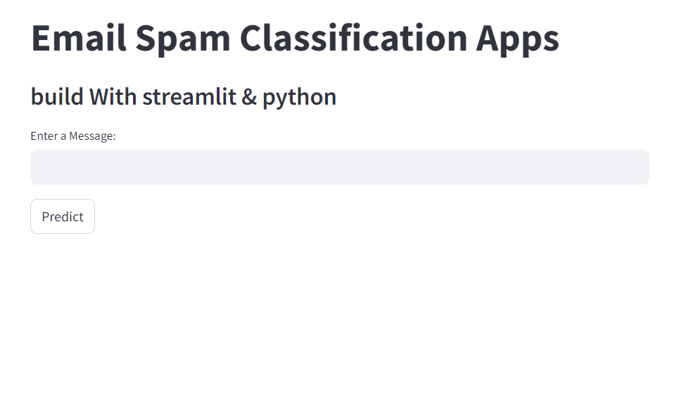
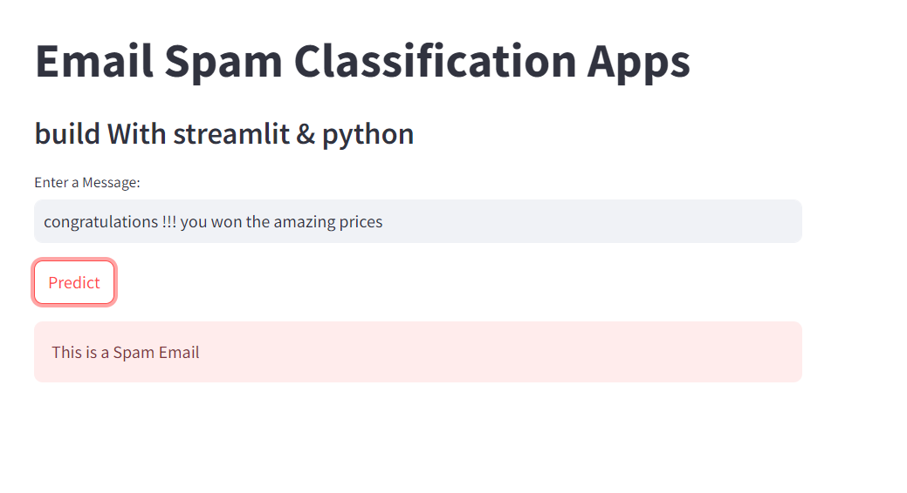
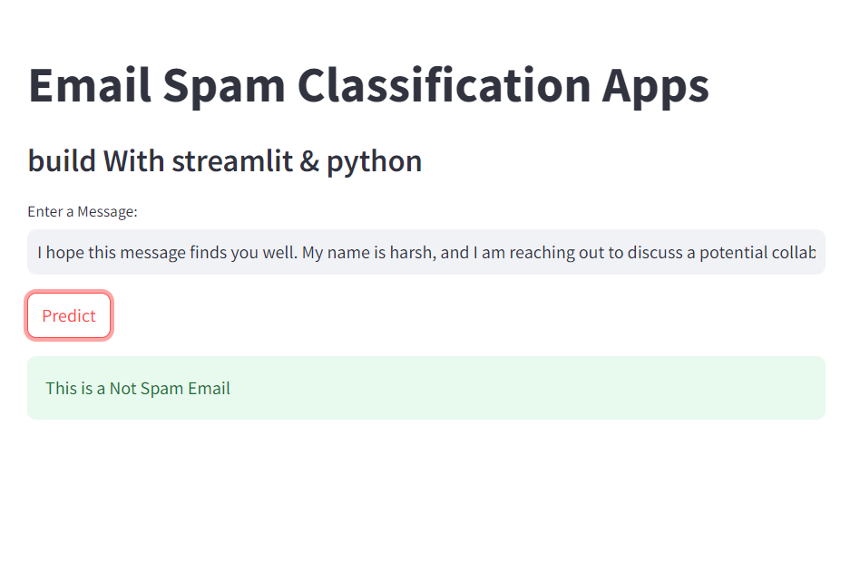

# Spam Mail Detection Project


## Overview

This project aims to detect spam emails using machine learning techniques. The goal is to create a model that accurately classifies emails as either spam or legitimate.

## Features

- **Machine Learning Algorithms**: Utilizes state-of-the-art algorithms for text classification.
- **Customizable Thresholds**: Allows adjusting thresholds for spam classification.
- **Performance Metrics**: Measures accuracy, precision, recall, and F1-score.

## Installation

1. Clone the repository:
   ```
   git clone https://github.com/HarshLambe/Spam_mail_detection.git
   cd spam-mail-detection
   ```
   
2. Install dependencies:
   ```
   pip install -r requirements.txt
   ```

## Usage

1. Train the model:
   ```
   python email_sms_spam.py
   ```

2. Run the application:
   ```
   streamlite run spamDectecor.py
   ```

## Screenshots
*This is the main interface of our project *
 

*Classified mail as Spam *


*Classified mail as Real *



## Contributing

Contributions are welcome! For major changes, please open an issue first to discuss what you would like to change.

#
### Contact

For questions or support, please contact [lambeharsh21@gmail.com](mailto:lambeharsh21@gmail.com).

